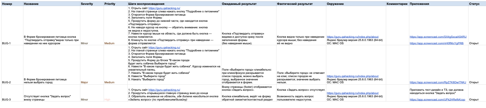

# Баг-репорт. 
### Введение
В рамках тестирования веб-приложения https://guru.qahacking.ru/ был проведен анализ функциональности сайта, а именоо главной страницы.
В процессе проверки было обнаружено несколько дефектов, влияющих на пользовательский опыт и корректность работы системы. Представленные ниже баг-репорты содержат детальное описание каждого отклонения от ожидаемого поведения.

#### Баг-репорт содержит все основные элементы:
##### Основные поля:
* ID/Номер - уникальный идентификатор отчета
* Название/Заголовок (Title) - краткое описание проблемы
* Серьезность (Severity) - влияние бага на систему 
* Приоритет (Priority) - очередность исправления 
##### Описание дефекта: 
* Шаги воспроизведения (Steps to Reproduce) - точная последовательность действий 
* Ожидаемый результат (Expected Result) - как должно работать правильно
* Фактический результат (Actual Result) - что происходит на самом деле
##### Дополнительная информация:
* Окружение (Environment) - ОС, браузер, версия приложения
* Приложения (Attachments) - скриншоты, видео, логи
* Статус (Status) - текущее состояние (Open, In Progress, Closed)

##### Представленные ниже баг-репорты содержат детальное описание каждого отклонения от ожидаемого поведения.
##### Отчеты структурированы для максимально простого воспроизведения проблем разработчиками. 

