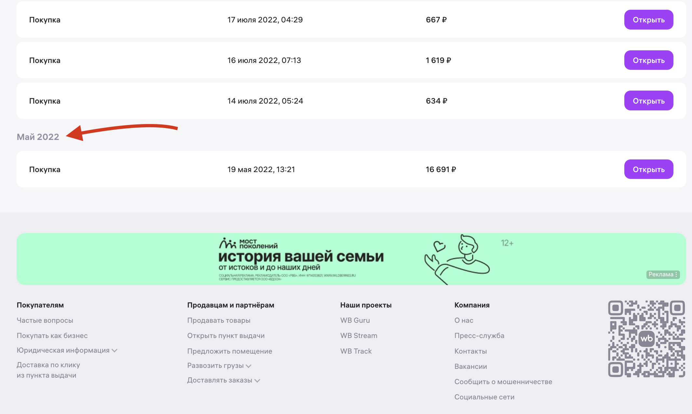
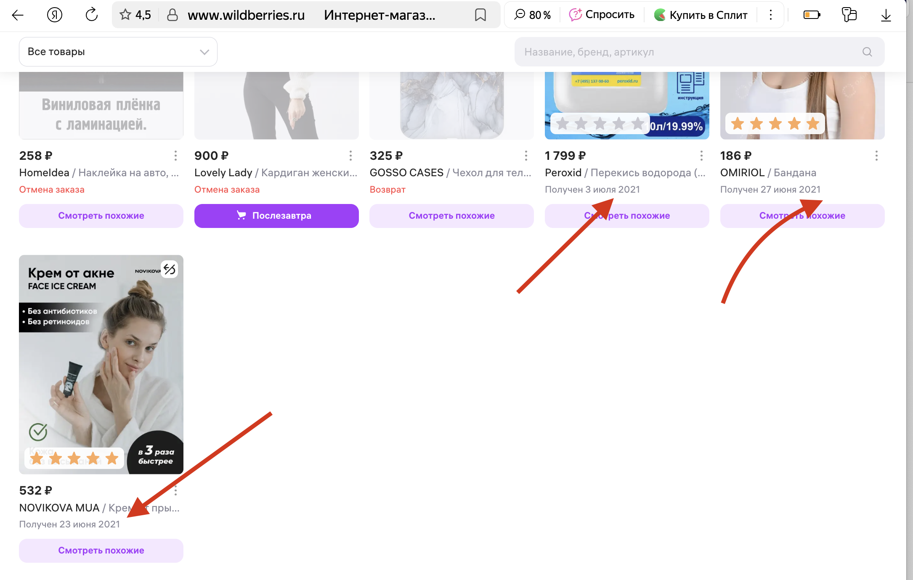
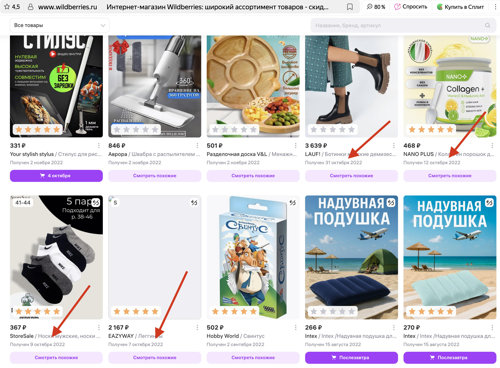

# Исследовательские туры Джеймса Уиттакера
## По книге Джеймса Уиттакера "Exploratory Software Testing"

Дж. Уиттакер создал набор готовых маршрутов для проверки, которые подойдут любому тестировщику. По сути, каждый такой маршрут — это и есть готовый план тестирования. Нам остаётся только следовать по этому проложенному пути.
#### Исследовательские туры 
- это подход к исследовательскому тестированию, где тестировщик выполняет заранее определённые «маршруты» (туры) по приложению с конкретной целью.

#### Каждый тур задаёт определённый фокус:
•	Тур, отмененный из-за дождя
•	Интеллектуальный тур
•	Тур чашки кофе
•	Музейный утр
•	Тур по плохим районам
•	Тур по путеводителю
•	Тур супермодели
•	Тур «второй бесплатно»
•	Тур домоседа
•	И др.

#### Наша задача:
1.	Выбрать несколько туров
2.	Изучить их цели
3.	Поставить себе таймер на определенное время для тестирования – 30 минут
4.	Провести исследование системы по выбранному туру, ни на что не отвлекаясь
5.	Записать результаты
6.	При необходимости повторить тур 

Этот метод помогает целенаправленно исследовать систему, не упуская ключевые аспекты, и быстро находить дефекты в конкретных сценариях использования.

##### Проведем тестирование сайта https://www.wildberries.ru по некоторым выбранным трем турам:

### 1.	Тур, отмененный из-за дождя

— это сценарий, при котором пользователь сталкивается с непредвиденным прерыванием сеанса (например, разрывом соединения или сбоем сервера). Идея тура в том, чтобы начать операцию и остановить ее.

Тестировщик проверяет, как система восстанавливается после сбоя: сохраняются ли введённые данные, можно ли продолжить работу с момента обрыва и корректно ли завершаются транзакции. Также важно убедиться, что после возобновления связи пользователь получает понятные инструкции, а не ошибки или пустые экраны.

#### I.	Проверка при обрыве сети «Интернет»

Шаги воспроизведения:
1.	Добавить в корзину 3 товара
2.	Перейти в корзину и убедиться, что товары добавлены в корзину
      •	Смоделировать обрыв связи, Интернета: открыть Инструменты разработчика (F12) → вкладка Network.
      •	Выбрать режим Offline
3.	Обновить страницу
      •	Вернуть подключение к сети открыть Инструменты разработчика (F12) → вкладка Network.
      •	Выбрать режим: Без ограничения
4.	Проверить:
      	Все товары остались в корзине.
      	Локально добавленный товар синхронизировался с сервером.
      	Нет дублей или потерь данных.

#### Итог:
Товары, добавленные в корзину, остаются в ней после обрыва сети и восстанавливаются при подключении без ручного вмешательства пользователя.

#### II.	Проверка при закрытии вкладки 

Шаги воспроизведения:
1.	Добавить в корзину 2 товара
2.	Перейти в корзину и убедиться, что товары добавлены в корзину
3.	Закрыть вкладку
4.	Открыть вкладку заново с помощью комбинаций command + shift + T
5.	Перейти в корзину
6.	Проверить:
      	Все товары остались в корзине.
      	Локально добавленный товар синхронизировался с сервером.
      	Нет дублей или потерь данных.

#### Итог:
Товары сохраняются в корзине

#### III.	Проверка синхронизации данных на разных устройствах

Предварительные шаги: авторизация на сайте с разных устройств под одним аккаунтом

Шаги воспроизведения:
1.	Добавить в корзину 4 товара с одного устройства (компьютера)
2.	Перейти в корзину и убедиться, что товары добавлены в корзину
3.	Проверить в мобильном приложении Wildberries корзину: товары должны были синхронизироваться между двумя устройствами
4.	Проверить:
      	Все товары остались в корзине.
      	Локально добавленный товар синхронизировался с сервером.
      	Нет дублей или потерь данных.

#### Итог:
Товары не дублируются и успешно синхронизируются на нескольких устройствах.

### 2.	Тур чашки кофе
- это сценарий, в котором тестировщик проверяет приложение так, как это сделал бы уставший человек утром, не до конца проснувшийся после чашки кофе. Фокус на простых, но частых действиях: быстрый поиск, навигация по основным разделам, использование подсказок и автозаполнения.
  Цель — убедиться, что ключевые функции работают интуитивно даже в условиях рассеянного внимания пользователя, и найти раздражающие мелочи, которые усложняют взаимодействие.

#### ! Тестирование проводилось ночью !

#### I. Проверка на оформление заказа с веб-приложения на компьютере

Шаги воспроизведения:
1. Открыть главную страницу
2. Добавить в корзину 2 товара
3. Перейти в корзину
4. Нажать кнопку «Заказать» - - - > Заказ невозможен. Ошибка. Подсказка: «Для оформления заказа выберите товар» и кнопка «Закрыть»
5. Выбрать 2 товара из корзины
6. Нажать кнопку «Заказать» - - - > Заказ успешно оформлен

#### Итог:

1. Моменты, на которые не обращаешь внимание при заказе:
- адрес доставки
- способ оплаты: сразу или при получении, или с использованием WB кошелька
- частями или полная оплата

#### Плюсы: 
Система запоминает и сохраняет указанные детали от предыдущего заказа, что удобно при следующем заказе – не нужно заново проверять и вводить данные адреса, способа оплаты
#### Минусы: 
Однако, если необходимо поменять адрес или способ оплаты – то система не предлагает перепроверить детали заказа перед его оформлением.

#### I. Проверка на оформление заказа с мобильного приложения

Шаги воспроизведения:
1. Открыть главную страницу
2. Добавить в корзину 2 товара
3. Перейти в корзину - - - > Система из всей корзины автоматически уже выбрала недавно добавленные 2 товара, можно сразу перейти к оформлению товара

#### Итог:
#### Плюсы: 
Система запоминает только что добавленные товары в корзину, что удобно для пользователя сразу перейти к оформлению товаров к заказу

#### НО есть НО

Протестируем мобильное приложение на оформление заказа, если закрыть приложение и начать работу заново
Давайте разберем подробно!

Шаги воспроизведения:
1. Открыть главную страницу
2. Добавить в корзину 2 товара
3. Перейти в корзину и убедиться, что товары добавлены
4. Выйти из приложения, очистить приложение из недавно открытых
5. Открыть приложение заново, добавить еще 2 товара в корзину
6. Перейти в корзину и убедиться, что товары добавлены в корзину.

#### Итог: 
Мы видим, что система автоматически выбрала уже 4 недавно добавленных товара, и можно сразу перейти к оформлению, нажать снизу кнопку «К оформлению» и далее нажать внизу кнопку «Заказать»

#### Минусы:
Ошибочно можно заказать ненужные товары, которые также недавно были добавлены в корзину

#### III. Проверка на удаление товара из корзины с веб-приложения на компьютере

Шаги воспроизведения:
1. Открыть главную страницу
2. Добавить в корзину 3 товара
3. Перейти в корзину
4. Выбрать 1 товар в корзине, нажать внизу карточки товара значок с мусорным ведром «Удалить» - - - > Товар удален. Сверху появляется уведомление с таймером 5 секунд «Удалили товары» и кнопка «Отменить»
5. Нажать кнопку «Отменить» в уведомлении «Удалили товары» - - - > Товар возвращен в корзину

#### Итог:
#### Плюсы: 
Удобна для пользователя функция возвращения товара в корзину, если товар случайно был удален
#### Минусы: 
Уведомление об удалении товара небольшое

### 3. Тур «Антиквар»
   — это исследование устаревших, редко используемых или забытых функций системы.
   Цель - найти дефекты в редко используемых, устаревших или забытых функциях системы, которые обычно остаются непроверенными при стандартном тестировании, и убедиться, что они не ломают текущую версию продукта.

##### Например, поиск архивных заказов, тестирование устаревших промо-акций или работа с устаревшим интерфейсом.
Проведем тестирование архивных заказов.

#### I. Проверка архивных заказов к повторному оформлению с веб-приложения на компьютере

Шаги воспроизведения:
1.	Перейти в раздел «Покупки»
2.	Перемотать покупки в самый низ, например до 2021 года
      Обратим внимание на интерфейс товаров:
- для удобства пользователя товары, которые доступные к заказу снова можно сразу добавить в корзину
- товары, недоступные к заказу, также отображаются корректно, но система вместо кнопки «добавить в корзину» предлагает «Смотреть похожие»
- товары, на которые был оформлен возврат или отменены, также либо доступные снова к заказу, либо система предлагает смотреть похожие товары
  
#### Плюсы: 
Пользователю не нужно искать заново товары или похожие товары через поисковую систему

#### II. Проверка раздела «Чеки» на выкупленные товары

Шаги воспроизведения:
1.	Перейти в раздел «Покупки»
2.	Перейти в раздел «Чеки»
3.	Перейти в самый низ страницы
      Для удобства откроем вторую вкладку
4.	Открыть вторую вкладку Вайлдбериз
5.	Перейти в раздел покупки
6.	Перейти в самый низ страницы
7.	Сравнить чеки и выкупленные товары

#### Итог:
1.	Мы видим, что не все чеки есть на выкупленные товары.
      Например, в моем случае, чеки начинаются только с 2022 года, а оформлять заказы на WB я начала с 2021 года
     
Чеки с 2022 года 

     
Заказы с 2021 года
  

2.	Если сравнивать выкупленные товары и чеки начиная с 2022 года, то также есть не все чеки на выкупленные товары
      В октябре 2022 года я заказала 4 товара на общую сумму 6 641 рубль, а в разделе «Чеки» отображаются только два товара на сумму 2 534 р. и 468 р.

Заказанные товары в октябре 2022 г.:

Чеки за октябрь 2022 г.:

#### Итог:
#### Указанные дефекты никак не влияют на работу приложения, да и вряд ли такие несостыковки кто-то заметит, тем более если уже прошло более чем 3 года!

### А вот что насчет актуальной информации в разделах, которые редко обновляются?
#### Например, в юридическом блоке?
Давайте разбираться

1.	Откроем любую страницу на https://www.wildberries.ru/
2.	В самом низу страницы, так называемом «подвале» есть раздел «Покупателям» - - - > раздел Юридическая информация
3.	Нажимаем на указанный раздел
4.	Появляется раскрывающийся список
5.	Открываем раздел «Правила продажи»
6.	Открывается новая вкладка:  Правила продажи товаров на торговой площадке Wildberries
7.	Пункт 2. Ссылка на Закон «О защите прав потребителей».

Мы видим, что на сайте добавлена устаревшая редакция закона, которая не обновлялась последние 5-6 лет. 
Приведенные ссылки на законы и нормативные акты не соответствуют текущим редакциям.
За это время появились новые изменения и новые статьи, например новая ст. 42.3

#### Итог:
Конечно, этот дефект никак не влияет на функциональность системы и работу пользователей, однако создает риски предоставления юридически неактуальной информации.
Рекомендуется обновить раздел в рамках плановой работы по поддержанию контента в актуальном состоянии.

#### Для удобства вместо ссылки на закон, который хранится на Янлдекс.Диске и автоматически не обновляется, можно добавить ссылку на Закон, который находится в системе «КонсультантПлюс» (https://www.consultant.ru/document/cons_doc_LAW_305/)
В «КонсультантПлюс» всегда есть актуальная редакция законов на сегодняшний день.

#### ВЫВОД
#### Таким образом, мы провели три исследовательских тура и обнаружили определенные плюсы и минусы работы приложения. 

